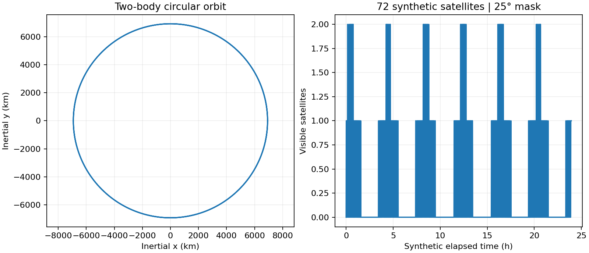
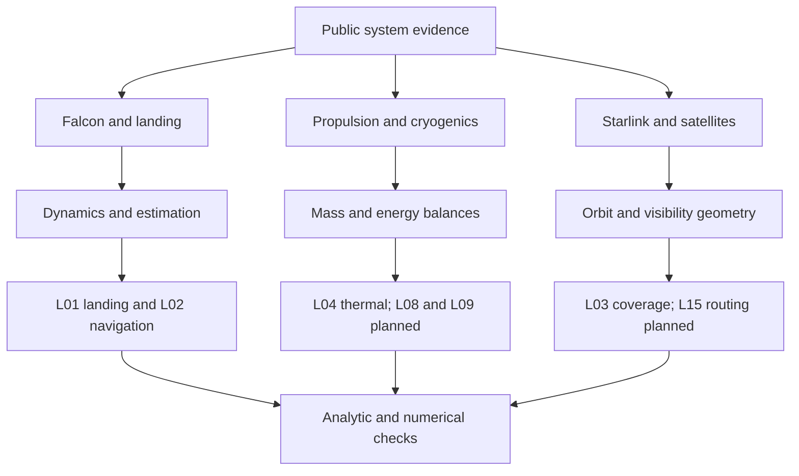

# SpaceX Engineering Research

Public aerospace evidence, original mathematical models and reproducible laptop experiments.

This is an independent educational and research project. It is not affiliated with, endorsed by, or maintained by SpaceX. The repository studies public information and related engineering methods; it contains no proprietary SpaceX code, internal CAD or flight-qualified models.

## Start here

* [Research findings](docs/research-report.md): what public evidence supports, its limits and the implementation strategy.
* [Technology taxonomy](docs/technology-taxonomy.md):13 domains connected to sources and projects.
* [Project catalogue](projects/README.md):22 ranked concepts, five runnable baselines and 17 implementation plans.
* [Source database](references/source-catalogue.md):51 records with provenance, review depth, reproducible use and rights.
* [Verification record](docs/validation.md): equations checked, measured results and remaining limitations.

## Why this repository exists

Public launch-system information is scattered across user guides, regulatory filings, academic literature and software projects. This repository connects those materials to exercises whose inputs, equations and results can be inspected. Every project follows a documented path from a source or engineering question to a model, implementation, experiment, visualization and limited conclusion.

The current state is a research baseline, version 0.1.0. Five experiments execute locally; the advanced catalogue is planned work. No production-readiness, flight-certification, adoption or performance claims are implied by this version.

## Publication status

The source package is prepared for [robotjaol/spacex-research](https://github.com/robotjaol/spacex-research), but the initial write was rejected by GitHub with HTTP403. No commit or push succeeded. Use the downloaded package until write access is restored; see [publication status](docs/github-publication.md).

## Quick start

Requires Python 3.11 or newer. The recorded environment uses Python 3.12.13, NumPy 2.3.5, SciPy 1.17.0 and Matplotlib 3.10.8 on Linux. No GPU or aerospace hardware is needed. Internet access is needed to obtain dependencies; the experiments themselves run offline.

Extract the provided ZIP and enter `spacex-research/`. Once source publication succeeds, the equivalent clone command is:

```bash
git clone https://github.com/robotjaol/spacex-research.git
cd spacex-research
```

```bash
python3 -m venv .venv
source .venv/bin/activate
python -m pip install -e . -c requirements-tested.txt
aero-lab all --output outputs --seed 7
python -m unittest discover -s tests -v
python scripts/check_repository.py
```

On Windows PowerShell, use `py -3 -m venv .venv` and `.venv\Scripts\Activate.ps1`, then run the remaining commands with `python`. Windows/macOS execution has not yet been verified. Direct dependency pins record the tested versions; they are not a complete transitive lockfile.

Each experiment is also available separately:

```bash
aero-lab landing --output outputs/landing
aero-lab navigation --output outputs/navigation
aero-lab orbit --output outputs/orbit
aero-lab thermal --output outputs/thermal
aero-lab avionics --output outputs/avionics
```

Outputs include PNG plots, CSV records and JSON metrics with the seed and runtime versions. The [notebook](notebooks/verified-baselines.ipynb) demonstrates the same Python API after installation.

## Runnable experiments

| Project | Level | Demonstration | Independent checks |
|---|---|---|---|
| [Vertical landing](projects/01-vertical-landing/README.md) |Intermediate|Sampled feedback, contact handling and 50 seeded scenarios|Closed-form free fall and timestep refinement|
| [Kalman navigation](projects/02-kalman-navigation/README.md) |Intermediate|Noisy position measurements and a ten-second outage|Covariance checks and 30 matched seed trials|
| [Orbit and coverage](projects/03-orbit-coverage/README.md) |Intermediate|Two-body propagation and 72 synthetic satellites|Analytic circular orbit, conserved quantities and geometric edge cases|
| [Cryogenic thermal warmup](projects/04-cryogenic-thermal/README.md) |Beginner|Sensible heating of an abstract thermal body|Exponential solution and energy balance|
| [Avionics fault response](projects/05-avionics-fault-injection/README.md) |Beginner|Median voting, missing data and latched SAFE state|Single-fault, common-mode and reset scenarios|



This figure is generated from synthetic inputs. Its visibility trace is not Starlink coverage or a service guarantee. More figures and their numeric records are in [examples/results](examples/results).

## Scope and technology map

The taxonomy covers launch vehicles, propulsion, GNC, landing, flight software, avionics, Starship systems, structures/materials, aerodynamics, manufacturing, testing, Starlink and mission engineering. A subtopic can be included while its internal implementation remains unknown. The [knowledge graph](docs/knowledge-graph.md) makes the source-to-project links explicit.



## Evidence standard

| Label | Meaning | Example |
|---|---|---|
| Confirmed public information |A source explicitly states the claim within a dated scope|A propulsion-cycle statement in a public document|
| Academic reconstruction |An implementation follows a published method and assumptions|Planned successive-convexification study|
| Engineering inference |A reasoned hypothesis or recommendation with stated uncertainty|A proposed subsystem decomposition|
| Educational approximation |Original simplified model with declared synthetic inputs|The five current experiments|

Source authority and model validity are separate. An official statement does not validate our model; a passing test does not validate a real vehicle. [Methodology](docs/research-methodology.md), [claims](references/claims.json) and [gaps](references/gaps.md) explain the review boundaries. Significant sourced claims point to their relevant primary document or author manuscript.

## Architecture

| Path | Responsibility |
|---|---|
| `docs/` |Research findings, taxonomy, topic notes, graph, methodology and validation|
| `references/` |Structured source/claim records, evidence gaps and search log|
| `papers/` |Paper/manual index and bibliographic metadata; no copyrighted PDF archive|
| `resources/` |Software/repository assessments, datasets and technical reference routes|
| `projects/` |22 model briefs, scoring matrix, implementation plans and status|
| `src/aerolab/` |Original model functions and reproducible command-line experiments|
| `tests/` |Analytic, numerical and failure-path checks|
| `examples/results/` |Committed synthetic outputs and numeric provenance|
| `notebooks/` |A small API walkthrough|
| `scripts/` |Offline structural checks and result-summary generation|
| `.github/` |CI configuration and contribution templates|

The small core deliberately uses three scientific Python dependencies. Optional tools and their license/maintenance assessments are listed in the [software catalogue](resources/github-projects.md). Installing or citing a package does not imply SpaceX uses it.

## Roadmap and contribution

The [roadmap](ROADMAP.md) orders work by validation dependencies. Next come actuator and sensor-model mismatch, coverage convergence and fault timing. Advanced optimization, thermochemistry, CFD and integrated simulation follow their own evidence gates. Research work includes replacing weak or inaccessible references and recording superseding official documents.

Contributions should ship a reproducible example, units/frame conventions, input provenance, acceptance criteria and an honest limitations statement. See [CONTRIBUTING.md](CONTRIBUTING.md), [CODE_OF_CONDUCT.md](CODE_OF_CONDUCT.md) and [SECURITY.md](SECURITY.md). Report a numerical discrepancy with the command, seed, package versions and complete inputs.

## Citation, rights and acknowledgements

Cite the original scientific/software sources as well as this repository. [CITATION.cff](CITATION.cff) contains the project metadata; record the commit used in any published experiment. The [paper index](papers/paper-index.md) distinguishes journals, conferences, technical reports and manuals.

Original repository code, text, diagrams and synthetic outputs use the [MIT License](LICENSE). Third-party documents and software keep their own terms; they are referenced and are not relicensed here. The project does not redistribute SpaceX guides, copyrighted papers, leaked material, restricted technical data or third-party implementation code. Public patents are disclosures, not open-source licenses or proof of deployed designs.

The work draws on public material from SpaceX, NASA, FAA, FCC, university authors and the upstream communities listed in the source catalogue. No endorsement by those organizations is implied.
