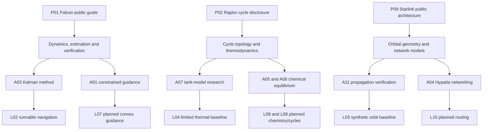

# Technology-to-project knowledge graph

The arrows represent a learning relationship, not an assertion that SpaceX uses the named open-source package. Source IDs resolve in [sources.json](../references/sources.json); project IDs resolve in the [catalogue](../projects/catalogue.json).

| Source family | Principle | Current model | Extension | Validation anchor |
|---|---|---|---|---|
| Falcon reliability/interface disclosures |Explicit states and fault assumptions|L05 scalar voting|F Prime/cFS component|Fault scenarios and output invariants|
| Reusable landing context |Force balance and state estimation|L01 vertical feedback;L02 filter|L07 constrained guidance|Analytic motion; independent nonlinear replay|
| Cryogenic-transfer context |Mass and energy conservation|L04 sensible heating|L21 two-tank transfer|Analytic energy balance; public property/test data|
| Starlink architecture |Orbit, visibility, connectivity|L03 synthetic geometry|L15 packets;L19 array factor|Conservation; horizon geometry; known pattern cases|
| Materials/manufacturing context |Structural response to variation|PlannedL13 beam benchmark|L20 tolerance propagation|Analytic deflection and mesh refinement|

The larger taxonomy is maintained as structured [technology-taxonomy.json](technology-taxonomy.json). It records every domain's evidence boundary and associated projects.
